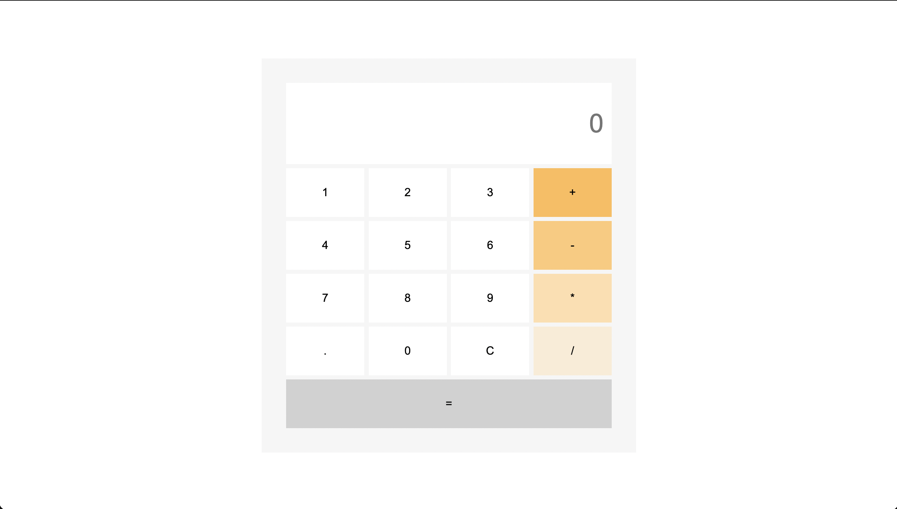
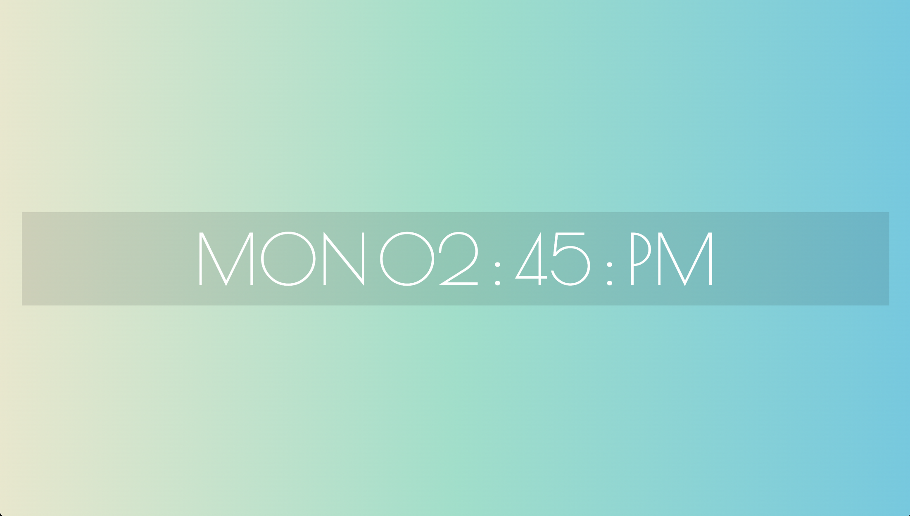

<h2>About project:</h2>

There are three branches:

<ul>
  <li>calculator</li>
  <li>digital clock</li>
  <li>slider</li>
</ul>
<h2>Technology stack:</h2>
<ul>
  <li>native JavaScript</li>
</ul>
<h2>Screenshots:</h2>

  
  
  

